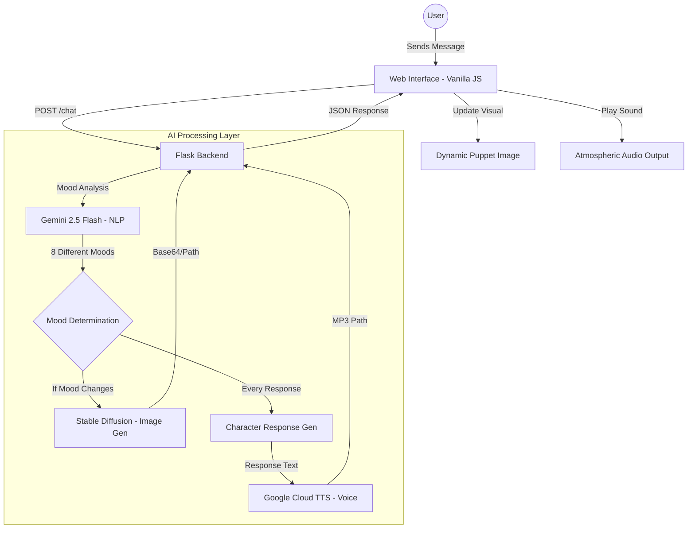

Project Members : 
Serhat Buğra Tana - 20220808001
Elif Buse Çınar - 20220808048
Musa Talat Demir - 20220808022

# 🎭 KNOCK — The Puppet's Door

KNOCK is a **premium artificial intelligence experience** where you interact with the puppet of a dying soldier returning from the 1973 Vietnam War. Inspired by Bob Dylan's *"Knockin' on Heaven's Door"*, this project presents war weariness, farewell, and freedom through the aesthetic of the "Department of Records."

It is not just a chatbot; it is an interactive storytelling experience where voice, image, and atmosphere merge.

---

## 🌟 Key Features

- **Advanced LLM Architecture (Gemini 2.5 Flash):** The project uses the latest Gemini model for both primary chat and background "Dynamic Mood Analysis." The puppet transitions between **8 different emotional states** based on your messages.
- **Character and Visual Consistency:** Stable Diffusion integration ensures the visual identity of the puppet is maintained across every message using fixed seeds and detailed character prompts.
- **Professional Voice Synthesis (Google Cloud TTS):** The puppet now speaks. It responds with a realistic "weary soldier" voice, enriched with SSML, with intonation that changes according to its mood.
- **Cinematic Interface:** Designed with Tailwind CSS, featuring a 1970s military records office atmosphere with film grain, typewriter effects, and a premium "Department of Records" theme.
- **Atmospheric Sound Experience:** Features a Bob Dylan classic playing in the background with an interactive volume slider.
- **Bypass Autoplay Policy:** A special "Enter the Archive" entry screen that overcomes browser sound blocking policies.

---

## 🛠️ Technical Architecture

The project is built on a Client-Server architecture and synchronizes three different generative AI layers:



### AI Techniques Used

1.  **Natural Language Processing (LLM):** The `Google Gemini 2.5 Flash` model is used to maintain the puppet's persona and analyze the emotional tone of each message.
2.  **Image Generation (Diffusion):** `Stable Diffusion` creates real-time visual representations of the puppet based on its mood, ensuring character consistency with fixed seeds.
3.  **Voice Synthesis (TTS):** `Google Cloud Text-to-Speech` simulates a weary, raspy soldier's tone using the "en-US-Wavenet-B" voice.

---

## 📸 Visual Showcase

Interface views of the application in different moods:

| Home Screen | Weary Mood |
| :---: | :---: |
|  |  |

| Nostalgic Mood | Angry Mood |
| :---: | :---: |
|  |  |

---

## 🎭 8 Different Moods

The puppet's world is shaped by your words:

1.  **Weary:** The default state in normal dialogue; loose strings, head bowed.
2.  **Nostalgic:** Focuses on faded photos when you talk about the past, home, or old memories.
3.  **Accepting:** The moment strings begin to break when you comfort him and provide peace.
4.  **Fading:** A silhouette merging with light when you say goodbye and let him go.
5.  **Angry:** A harsh, red-lit atmosphere that appears when you are angry with commanders or speak aggressively.
6.  **Afraid:** The puppet taking refuge in shadows when talking about death, darkness, or the unknown.
7.  **Regretful:** Kneeling in the mud under rain when talking about losses and regrets.
8.  **Hallucinating:** Moments where reality disappears in surreal and psychedelic conversations.

---

## 🚀 Installation and Execution

### 1. Prepare the Environment
```bash
pip install -r requirements.txt
```

### 2. Define API Keys
Add these keys to your `.env` file:
```env
GEMINI_API_KEY=your_gemini_key
GOOGLE_API_KEY=your_google_tts_key
```

### 3. Background Music
Place any atmospheric music you like in the `static/audio/background.mp3` path.

### 4. Start
```bash
python app.py
```
Go to `http://localhost:5000` and open the files by clicking "Enter the Archive."

---

*"Mama, take this badge off of me / I can't use it anymore"* — Bob Dylan, 1973
